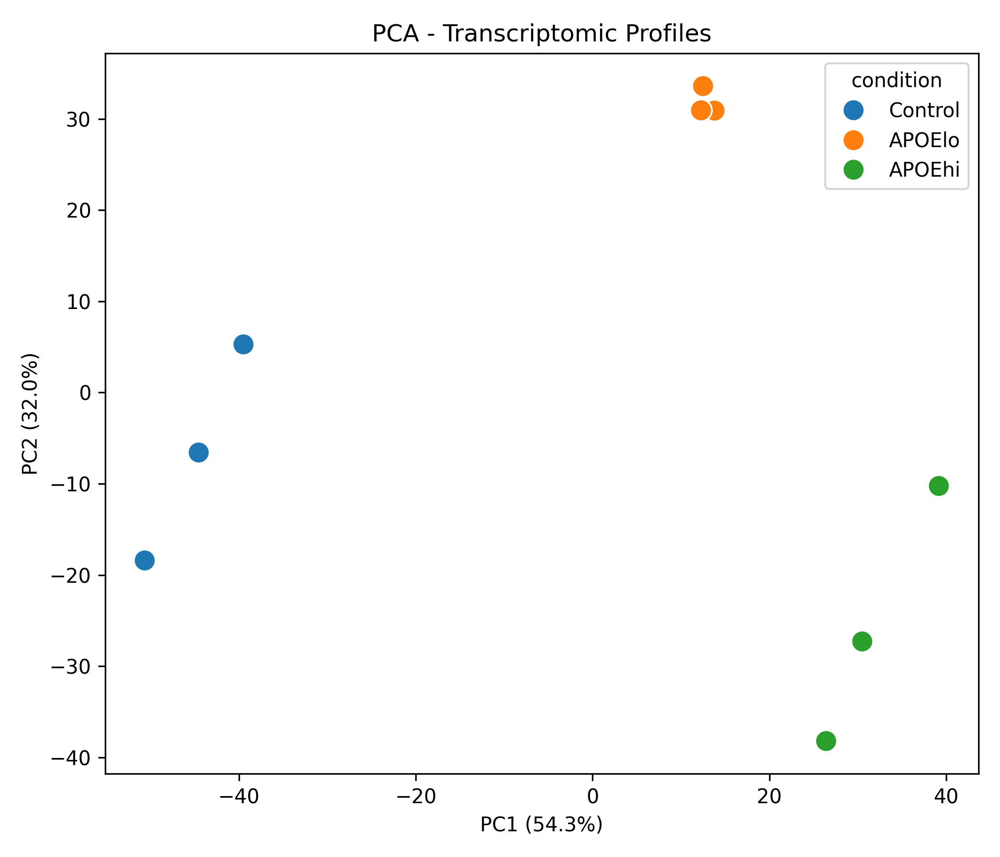
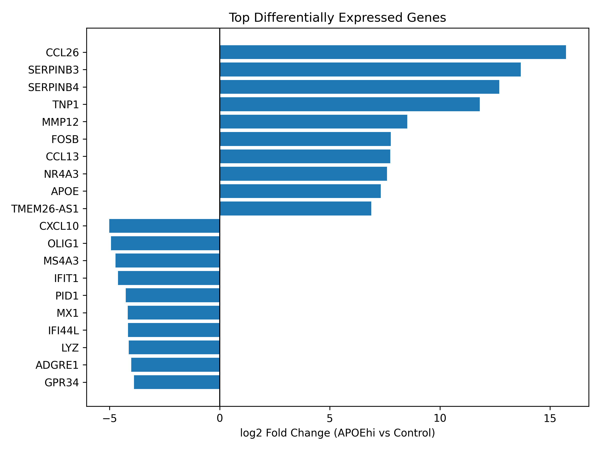
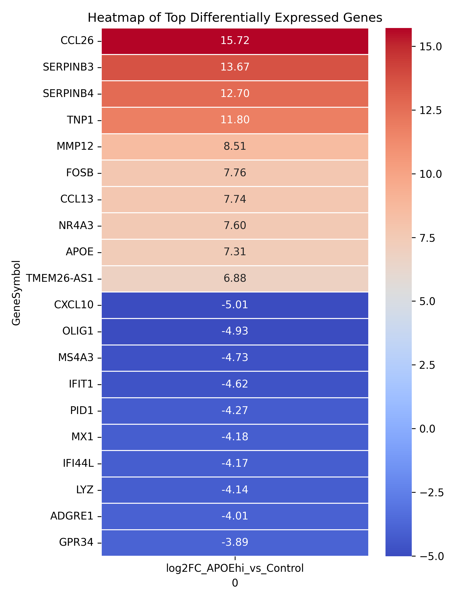

# Genomics RNA-seq Analysis (APOE macrophages)

[](https://www.python.org/)
[](LICENSE)

Exploratory **bulk RNA-seq** reanalysis of THP-1 macrophage FPKM data comparing **APOEhi** vs **Control**, with PCA across Control / APOElo / APOEhi.

**Data source:** supplementary materials from [DOI 10.1016/j.canlet.2026.218605](https://doi.org/10.1016/j.canlet.2026.218605)


*Volcano plot (APOEhi vs Control): red = upregulated, blue = downregulated (`|log2FC| > 1`, `FDR < 0.05`).*

---

## Key findings (exploratory)

- **401** genes upregulated and **636** downregulated in APOEhi vs Control under `|log2FC| > 1` and `FDR < 0.05`.
- PCA separates transcriptomic profiles by condition (Control, APOElo, APOEhi).
- Top fold-change genes are summarized in barplot and heatmap outputs under `figures/`.

## Limitations

- Analysis uses **FPKM** (not raw counts) and **Welch t-tests** on log2-transformed values — suitable for exploration, not definitive DE.
- Small biological replication (**n = 3** per condition).
- Main DE contrast is **APOEhi vs Control**; APOElo is included in PCA but not as a primary DE contrast.
- For rigorous RNA-seq DE, prefer raw counts with **DESeq2** or **edgeR**.

---

## Quick start

```bash
python -m venv .venv
.venv\Scripts\activate          # Windows
# source .venv/bin/activate     # macOS/Linux
pip install -r requirements.txt
```

1. Ensure `rnaseq-01.xlsx` is in the project root (see [docs/DOWNLOAD_DATA.md](docs/DOWNLOAD_DATA.md)).
2. Open and run [`Analysis.ipynb`](Analysis.ipynb), **or** run without Jupyter:

```bash
python scripts/run_de_analysis.py
```

---

## Repository layout

```text
Analysis.ipynb              # Main analysis notebook
rnaseq-01.xlsx              # FPKM expression matrix
requirements.txt
LICENSE
docs/DOWNLOAD_DATA.md       # How to obtain the supplementary data
scripts/run_de_analysis.py  # End-to-end script (figures + CSV)
figures/                    # Plots and DE gene table
```

---

## Analysis workflow

| Step | Status |
|------|--------|
| Load and clean FPKM matrix | Done |
| Mean expression and log2 fold change | Done |
| Welch t-test + Benjamini–Hochberg FDR | Done |
| Volcano, PCA, top genes, heatmap | Done |
| Export DE gene table (CSV) | Done |
| Count-based DE (DESeq2/edgeR) | Out of scope (exploratory FPKM project) |

**Main comparison:** `APOEhi vs Control`

---

## Main outputs (`figures/`)

| File | Description |
|------|-------------|
| `volcano_corrected_labeled_top1.png` | Volcano plot with extreme genes labeled |
| `pca.png` | PCA of Control / APOElo / APOEhi |
| `top_genes_clean.png` | Top up/down genes by log2FC |
| `heatmap_clean.png` | Heatmap of top DE genes |
| `apoehi_vs_control_de_genes.csv` | Gene-level DE table (log2FC, p, FDR) |







---

## Skills demonstrated

Python · pandas · NumPy · SciPy · scikit-learn · matplotlib · seaborn · Jupyter · differential expression · FDR correction · scientific visualization · reproducible workflows

---

## CV one-liner (copy/paste)

> Bulk RNA-seq exploratory reanalysis (THP-1 macrophages, APOEhi vs Control): FPKM cleaning, log2FC, Welch t-test with FDR, volcano/PCA/heatmap, and versioned DE gene table (Python). [https://github.com/OscarMunguia/genomics-rnaseq-analysis](https://github.com/OscarMunguia/genomics-rnaseq-analysis)

---

## License and citation

MIT — see [LICENSE](LICENSE). Dataset subject to the original journal / publisher terms; cite [DOI 10.1016/j.canlet.2026.218605](https://doi.org/10.1016/j.canlet.2026.218605) when using the data.
