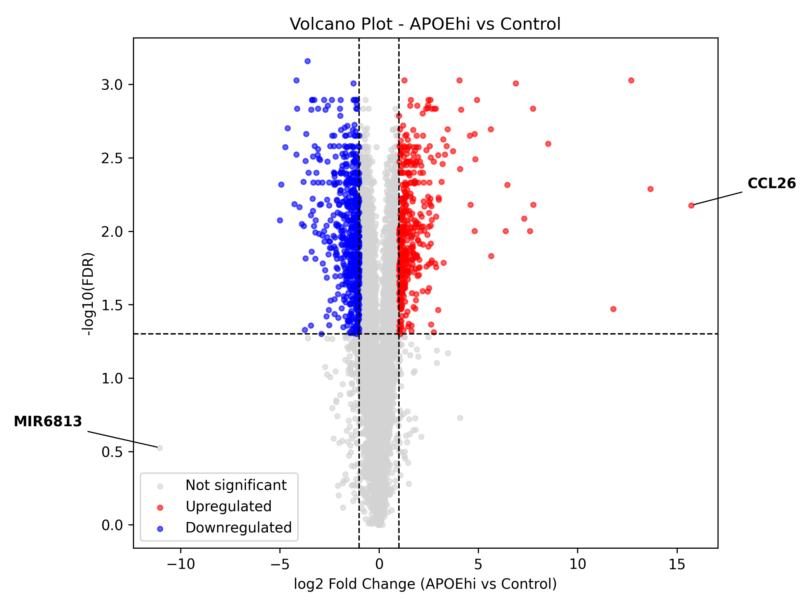

# Genomics RNA-seq Analysis

This project contains an exploratory RNA-seq analysis comparing APOEhi macrophages against control macrophages.

## Dataset

The analysis uses RNA-seq FPKM expression data from the file:

- `rnaseq-01.xlsx`

The dataset contains gene expression values for:

- Control samples
- APOEhi samples
- APOElo samples

## Analysis

The notebook includes:

- Data loading and cleaning
- Calculation of mean expression per condition
- Log2 fold change analysis
- Welch's t-test on log2-transformed FPKM values
- FDR correction using the Benjamini-Hochberg method
- Volcano plot
- PCA visualization
- Heatmap of selected differentially expressed genes

## Main Comparison

The main comparison performed in this project is:

```text
APOEhi vs Control
```

## Results



The volcano plot highlights genes with:

- `|log2FC| > 1`
- `FDR < 0.05`

## Figures

Generated plots are saved in the `figures/` folder.

Example outputs include:

- Volcano plot
- PCA plot
- Heatmap
- Top differentially expressed genes plot

## Notes

This analysis is exploratory. It uses FPKM values and Welch's t-test on log2-transformed expression values.

For a more rigorous RNA-seq differential expression analysis, raw count data and specialized tools such as DESeq2 or edgeR would be recommended.


## Data Source

The RNA-seq data used in this project were obtained from the supplementary materials of the following published article:

https://doi.org/10.1016/j.canlet.2026.218605

The dataset was used for educational and exploratory analysis purposes. Please refer to the original publication for data ownership, experimental design, and biological interpretation.